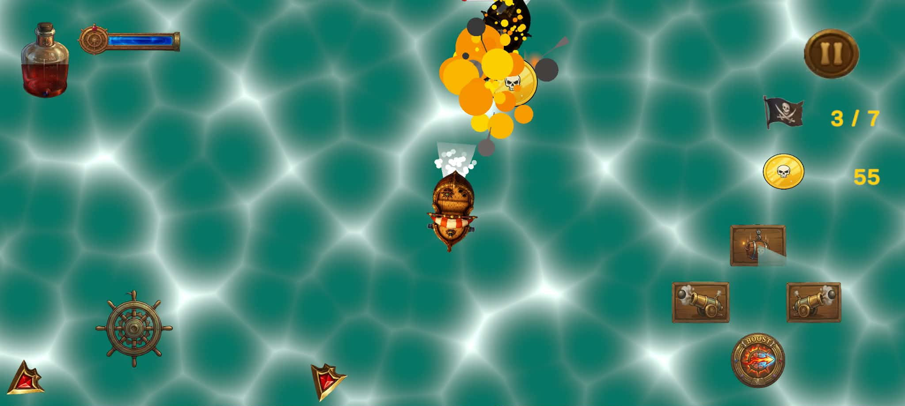
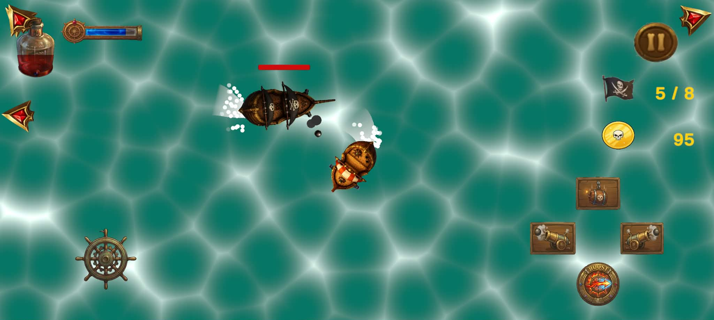
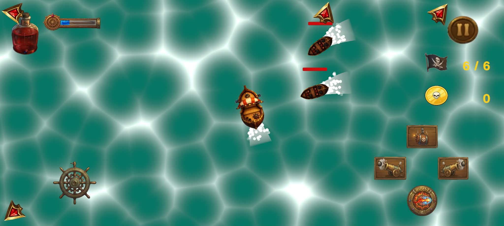

# Skullywag

Skullywag is a 2D top-down pirate-themed shooter developed in Unity. Sail the high seas, defeat enemy ships and bosses, collect coins, and upgrade your ship.

## Engine & Technologies

Unity, C#, and Android

## My Role

Solo Developer — responsible for the game's programming, gameplay systems, enemy AI, combat, boss encounters, progression, and Android development.

## Screenshots

### Gameplay

### Ship Combat With Enemy Brig

### Ship Combat With Enemy Galleon

### Ship Combat With Enemy Rowboat

## Gameplay Systems

### Player & Combat

- Developed player movement and controls using Unity's Input System.
- Implemented cannon-based combat and projectile systems.
- Built configurable weapon damage, cooldown, projectile speed, and force systems.
- Implemented mobile-friendly controls for Android.

### Enemy AI

- Developed multiple enemy types with different behaviors and combat characteristics.
- Implemented enemy targeting, movement, and attack behaviors.
- Created enemy spawning systems for wave-based gameplay.

### Boss System

- Developed boss encounters with multiple combat phases.
- Implemented boss health tracking and boss UI.
- Created phase transitions based on boss health.
- Added dedicated boss music and audio transitions.

### Shop & Progression

**Currently in progress.**

- Implemented the foundation of the in-game currency system.
- Began development of the shop and player upgrade systems.
- Implemented persistent upgrade levels and save/load functionality.
- Currently expanding the shop and progression systems.

### Mobile Development

- Developed the game for Android using Unity.
- Implemented touch-friendly controls and mobile UI.
- Configured gameplay systems with mobile devices in mind.
